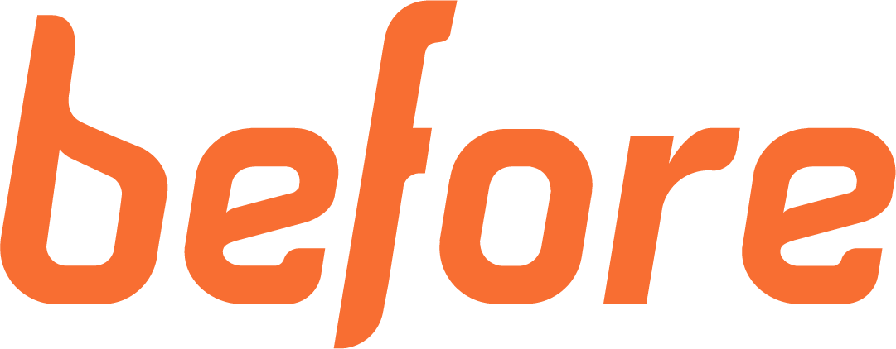
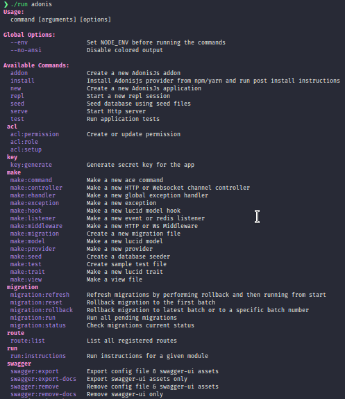

<p align="center">
  
</p>
<h1 align="center">
  BeGaming
</h1>

Este projeto tem como objetivo facilitar a gestão e o acompanhamentos do sistema de bagdes que a Before implantou.

## Como Contribuir?

Acesse [Github](https://github.com/ppanissa/before-badges), de FORK no Projeto.

É possível contribuir de várias formas ao projeto dentre elas são:

- Desenvolver funcionalidades
- Sugerir funcionalidades
- Reportar erros
- Corrigir erros
- Aumentar a cobertura de testes
- Incrementar documentação

Por favor leia nosso [Código de Conduta] para detalhes do nosso código de conduta.

[código de conduta]: .github/CODE_OF_CONDUCT.md

## O que está sendo utilizado:

- [Docker](https://docs.docker.com/install/)
- NodeJS: <small>Caso não tenha o node instalado, tudo bem! Trabalharemos com containers.</small>
  - Framework: [AdonisJS](https://adonisjs.com/docs/4.1/installation)
- Banco de Dados: **Postgres**
- **Redis**: Gerenciador de Filas e envios
  - [Bull](https://github.com/Rocketseat/adonis-bull)
- Bibliotecas:
  - [Swagger](https://www.npmjs.com/package/@sci-ventures/adonis-swagger)
  - [Date FNS](https://date-fns.org/)

Dica: quem utiliza Visual Studio Code

- Adicione os pacotes
  - [ESLint](https://marketplace.visualstudio.com/items?itemName=dbaeumer.vscode-eslint)
  - [Prettier](https://marketplace.visualstudio.com/items?itemName=esbenp.prettier-vscode)
  - [EditorConfig](https://marketplace.visualstudio.com/items?itemName=EditorConfig.EditorConfig)
  - [AdonisJS](https://marketplace.visualstudio.com/items?itemName=hridoy.adonisjs-snippets)
  - [Better Comments](https://marketplace.visualstudio.com/items?itemName=aaron-bond.better-comments)
  - [Bracket Pair Colorizer](https://marketplace.visualstudio.com/items?itemName=CoenraadS.bracket-pair-colorizer)

## Começando

```sh
# Copie o projeto
$ git clone git@github.com:seugithub/before-badges.git begaming
# Acesse a pasta
$ cd begaming
# Altere a permissão dos arquivos
$ chmod +x run script/before.sh
# Tenha o docker e docker-compose instalado em sua maquina
# caso não tenha
# https://docs.docker.com/install/
$ ./run start
```

## Instalando pacotes

```sh
$ ./run npm install packages-name
## ou
$ ./run adonis install packages-name
```

## Acessando Bash

Como utilizamos docker para trabalharmos, a API tbm roda em container <br />
para excutar comandos diferente do padrão é necessário acessar o BASH

```sh
$ ./run bash container_name (api / pg / redis)
```

## Todos os Comandos

| Command                          | Descrição                                                    |
| -------------------------------- | ------------------------------------------------------------ |
| ./run adonis                     | Comandos do adonis (Estilo: **php artisan**)                 |
| ./run start                      | Iniciar Aplicação Docker                                     |
| ./run restart                    | Reniciar Docker                                              |
| ./run restart **container_name** | Reniciar os containers [ **api** / **pg** / **redis** ]      |
| ./run stop                       | Parar os containers Docker                                   |
| ./run bash **container_name**    | Acessar o bash do container [ **api** / **pg** / **redis** ] |
| ./run test                       | Rodar os tests do sistema                                    |
| ./run recreate                   | Ele irá apagar todos os container e recria-los               |

## List Comandos "ADONIS"

```sh
$ ./run adonis lista_de_comandos_abaixo
```


